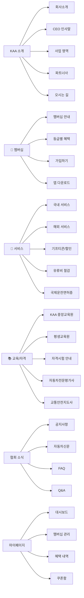

# KAA 한국자동차협회 홈페이지 리뉴얼 계획안

## 📋 프로젝트 개요

한국자동차협회(KAA) 홈페이지의 대대적 리뉴얼을 통해 **수익화 중심 플랫폼**으로 전환합니다.
기존 정적 소개 중심 사이트에서 → **프리미엄 멤버십 & 할인 혜택 플랫폼**으로 진화시키며,
**3D 오브젝트**와 **글래스모피즘** 기반의 세련된 UI를 적용합니다.

> [!IMPORTANT]
> 이 계획안은 전체 리뉴얼의 **1단계: 홈페이지 프론트엔드**에 집중합니다.
> 앱 서비스, 백엔드 API, 결제 시스템 등은 2단계에서 진행합니다.

---

## 🔍 현행 사이트 분석

### 현재 메뉴 구조

| 대메뉴 | 하위 메뉴 |
|--------|----------|
| **KAA(주)** | 회사소개, CEO인사말, 사업내용(플랫폼/인슈런스/모빌리티/평가/교육), 파트너사, 오시는 길 |
| **멤버십** | 멤버십-개인, 국내 서비스, 국제 서비스 |
| **한국자동차협회** | 협회 안내, 국제협약단체, 자격시험(자동차전문평가사/교통안전지도사), 실천서명운동 |
| **기타 서비스** | KAA 중앙교육원, 자동차신문, 평생교육원, 국제운전면허증, 자동차관리 정보 |
| **공지/문의** | 공지사항, Q&A, FAQ |
| **마이페이지** | 회원가입, 로그인, ID/PW 찾기, 마이페이지, 유료회원전환 |

### 현재 멤버십 등급

| 등급 | 기간 | 유형 |
|------|------|------|
| Platinum | 10년 | 유료 |
| Gold | 5년 | 유료 |
| Silver | 1년 | 유료 |
| 평생회원 | 평생 | 일반 |

### 현행 사이트 문제점
- 구식 디자인 (다크 테마이나 레거시 스타일)
- 정적 콘텐츠 위주, 인터랙션 부재
- 수익화 구조 부재 (멤버십 혜택이 명확하지 않음)
- 모바일 최적화 미흡
- 앱 서비스 연동 부재

---

## 🎯 리뉴얼 목표

### 핵심 목표
1. **수익화 극대화** — 유료 멤버십 가입 전환율 극대화
2. **프리미엄 경험** — 3D 오브젝트, 애니메이션으로 몰입감 있는 UX
3. **앱 서비스 연계** — 유류비 절감, 기프티콘 할인 등 실질 혜택 강조
4. **신뢰도 향상** — 협회의 공신력과 파트너십 부각

### 디자인 컨셉

```
┌─────────────────────────────────────────────┐
│     🎨 "Premium Mobility Experience"        │
│                                             │
│  • 다크 모드 (Deep Navy → Black gradient)   │
│  • 3D 자동차 오브젝트 (Three.js / Spline)   │
│  • 글래스모피즘 카드 UI                      │
│  • 네온 악센트 (Electric Blue + Gold)        │
│  • 마이크로 애니메이션                       │
│  • 프리미엄 타이포그래피 (Pretendard)         │
└─────────────────────────────────────────────┘
```

---

## 🗂️ 리뉴얼 메뉴 구조 (신규)

> [!NOTE]
> 기존 메뉴를 수익화 중심으로 재편성하고, 사용자 접근성을 높이는 방향으로 변경합니다.

### 1차 네비게이션 (메인 메뉴)



---

## 🖥️ 페이지별 설계

### 1. 메인 페이지 (Hero)

**레이아웃 구성:**

| 섹션 | 설명 | 3D/UI 요소 |
|------|------|-----------|
| **Hero** | 풀스크린 3D 자동차 모델 + 캐치프레이즈 | Three.js 3D 자동차 모델, 파티클 배경 |
| **멤버십 CTA** | "지금 가입하고 혜택을 누리세요" | 3D 멤버십 카드 플립 애니메이션 |
| **혜택 하이라이트** | 유류비 절감, 기프티콘, 할인 수치 | 카운터 애니메이션, 아이콘 3D 오브젝트 |
| **사업 영역** | 5대 사업부 소개 카드 | 글래스모피즘 카드, 호버 3D 틸트 |
| **파트너사** | 로고 캐러셀 | 무한 스크롤 로고 벨트 |
| **앱 다운로드** | 앱 스토어 링크 + 폰 목업 | 3D 스마트폰 모델, 패럴랙스 |
| **뉴스/공지** | 최신 공지사항, 자동차신문 | 카드 슬라이더 |
| **Footer** | 연락처, 약관, 소셜 | 미니멀 디자인 |

**Hero 섹션 상세:**
```
┌──────────────────────────────────────────────────┐
│  ┌─── 3D 자동차 모델 (인터랙티브 회전) ───┐      │
│  │        🚗 ← 마우스로 회전 가능           │      │
│  └──────────────────────────────────────────┘      │
│                                                    │
│  "당신의 자동차 생활을 더 스마트하게"                │
│  ━━━━━━━━━━━━━━━━━━━━━                             │
│  한국자동차협회와 함께하면                           │
│  유류비 최대 15% 절감! 🔥                           │
│                                                    │
│  [ 멤버십 가입하기 ]  [ 혜택 알아보기 ]              │
│                      ↕                              │
│  📱 앱 다운로드                                     │
└──────────────────────────────────────────────────┘
```

### 2. 멤버십 페이지

**핵심 구성:**

| 요소 | 설명 |
|------|------|
| 3D 카드 비교 | Platinum / Gold / Silver 3D 멤버십 카드가 떠오르며 비교 |
| 혜택 비교표 | 인터랙티브 비교 테이블 (호버 시 하이라이트) |
| 할인 계산기 | "연간 절감액 계산기" — 주행거리 입력 → 절감액 표시 |
| 기프티콘 미리보기 | 사용 가능한 기프티콘 브랜드 로고 그리드 |
| CTA | 등급별 가입 버튼 (Glow 효과) |

### 3. 서비스 페이지 (수익화 핵심)

| 섹션 | 내용 |
|------|------|
| **기프티콘 마켓** | 할인된 기프티콘 구매 (커피, 편의점, 주유 등) |
| **유류비 절감** | 제휴 주유소 리스트 + 할인율 안내 |
| **국내 서비스** | 로드서비스, 차량 점검, 보험 할인 |
| **해외 서비스** | 국제운전면허증, 해외 긴급출동 |

### 4. 앱 다운로드 페이지

| 요소 | 설명 |
|------|------|
| 3D 폰 목업 | 앱 화면이 보이는 3D 스마트폰 |
| 기능 소개 | 수평 스크롤 기능 카드 |
| QR 코드 | 즉시 다운로드용 QR |
| 스토어 버튼 | App Store / Google Play 링크 |

---

## 🛠️ 기술 스택

| 구분 | 기술 | 설명 |
|------|------|------|
| **프레임워크** | Vite + Vanilla JS | 빠른 빌드, 가벼운 번들 |
| **3D 엔진** | Three.js + GLTFLoader | 3D 자동차/카드 오브젝트 렌더링 |
| **애니메이션** | GSAP (GreenSock) | 스크롤 기반 애니메이션, 마이크로 인터랙션 |
| **스타일링** | Vanilla CSS + CSS Variables | 글래스모피즘, 그라디언트, 다크모드 |
| **폰트** | Pretendard (한글) + Inter (영문) | 프리미엄 타이포그래피 |
| **아이콘** | Lucide Icons | 깔끔한 라인 아이콘 |
| **슬라이더** | Swiper.js | 카드 슬라이더, 캐러셀 |

---

## 📁 프로젝트 구조

### [NEW] 프로젝트 디렉토리

```
g:\내 드라이브\anti\2026-02-20\kaa-website\
├── index.html              # 메인 페이지
├── membership.html         # 멤버십 페이지
├── services.html           # 서비스 페이지
├── education.html          # 교육/자격 페이지
├── about.html              # KAA 소개 페이지
├── news.html               # 협회 소식 페이지
├── app-download.html       # 앱 다운로드 페이지
│
├── css/
│   ├── global.css          # 글로벌 스타일, CSS 변수, 리셋
│   ├── components.css      # 재사용 컴포넌트 스타일
│   ├── hero.css            # 히어로 섹션 스타일
│   ├── membership.css      # 멤버십 관련 스타일
│   ├── animations.css      # 애니메이션 키프레임
│   └── responsive.css      # 반응형 스타일
│
├── js/
│   ├── main.js             # 앱 진입점
│   ├── three-scene.js      # Three.js 3D 씬 관리
│   ├── animations.js       # GSAP 애니메이션
│   ├── membership.js       # 멤버십 계산기, 인터랙션
│   ├── navigation.js       # 네비게이션 로직
│   └── utils.js            # 유틸리티 함수
│
├── assets/
│   ├── models/             # 3D 모델 파일 (.glb)
│   ├── images/             # 이미지 파일
│   ├── icons/              # 아이콘 파일
│   └── fonts/              # 웹폰트
│
└── package.json
```

---

## 🎨 디자인 시스템

### 컬러 팔레트

```css
/* 기본 색상 */
--bg-primary:    #0A0E1A;    /* 깊은 네이비 */
--bg-secondary:  #111827;    /* 다크 그레이 */
--bg-card:       rgba(255,255,255,0.05);  /* 글래스 카드 */

/* 악센트 */
--accent-blue:   #3B82F6;    /* 일렉트릭 블루 */
--accent-gold:   #F59E0B;    /* 골드 */
--accent-purple: #8B5CF6;    /* 퍼플 */

/* 멤버십 등급 */
--platinum:      linear-gradient(135deg, #E5E7EB, #9CA3AF, #E5E7EB);
--gold:          linear-gradient(135deg, #F59E0B, #FCD34D, #F59E0B);
--silver:        linear-gradient(135deg, #9CA3AF, #D1D5DB, #9CA3AF);

/* 텍스트 */
--text-primary:  #F9FAFB;
--text-secondary:#9CA3AF;
```

### 글래스모피즘 기본 스타일

```css
.glass-card {
  background: rgba(255, 255, 255, 0.05);
  backdrop-filter: blur(20px);
  border: 1px solid rgba(255, 255, 255, 0.1);
  border-radius: 16px;
  box-shadow: 0 8px 32px rgba(0, 0, 0, 0.3);
}
```

### 3D 카드 틸트 효과

```css
.tilt-card {
  transform-style: preserve-3d;
  transition: transform 0.3s ease;
}
.tilt-card:hover {
  transform: perspective(1000px) rotateX(5deg) rotateY(-5deg);
}
```

---

## 📱 반응형 브레이크포인트

| 디바이스 | 너비 | 설명 |
|----------|------|------|
| Desktop | ≥1200px | 풀 레이아웃, 3D 전체 활성화 |
| Tablet | 768~1199px | 2열 그리드, 3D 간소화 |
| Mobile | <768px | 1열 스택, 3D 비활성화/정적 이미지 |

---

## 📐 주요 컴포넌트 사양

### 네비게이션 바
- 스크롤 시 글래스모피즘 배경 활성화
- 로고 + 6개 메인 메뉴 + CTA 버튼("무료 가입")
- 모바일: 햄버거 메뉴 → 풀스크린 오버레이

### 3D 히어로 자동차
- Three.js로 GLTF 자동차 모델 로드
- 마우스 움직임에 따른 부드러운 회전
- 파티클 배경 (별/빛 입자)
- 스크롤 시 줌아웃 + 페이드 효과

### 멤버십 3D 카드
- CSS 3D transform으로 카드 플립
- 앞면: 등급명, 가격, 주요 혜택 3개
- 뒷면: 상세 혜택 리스트
- 호버 시 홀로그래픽 반짝임 효과

### 혜택 카운터
- Intersection Observer로 뷰포트 진입 시
- 숫자 카운트업 애니메이션 (예: "₩150,000 절약")
- GSAP ScrollTrigger 활용

---

## 📊 수익화 전략 반영 요소

### 홈페이지에 반영할 수익 포인트

| 요소 | 위치 | 설명 |
|------|------|------|
| **멤버십 CTA** | Hero 바로 아래 | 3D 카드 + "지금 가입" 강조 |
| **절감액 시뮬레이터** | 멤버십 페이지 | 월 주행거리 → 연간 절감액 계산 |
| **기프티콘 혜택 쇼케이스** | 서비스 페이지 + 홈 | 인기 기프티콘 할인율 실시간 표시 |
| **앱 다운로드 배너** | 모든 페이지 하단 | 고정 하단 바 or 플로팅 CTA |
| **파트너사 로고** | 홈 중간 | 신뢰도 향상용 로고 캐러셀 |
| **회원 후기** | 홈 + 멤버십 | 실 사용자 후기 카드 |

---

## 🚀 개발 로드맵

### Phase 1: 기초 (1주차)
1. Vite 프로젝트 설정
2. 디자인 시스템 (CSS 변수, 글로벌 스타일)
3. 네비게이션 컴포넌트
4. 기본 레이아웃 구조

### Phase 2: 메인 페이지 (2주차)
1. 3D 히어로 섹션 (Three.js)
2. 멤버십 CTA 섹션
3. 혜택 하이라이트 (카운터 애니메이션)
4. 사업 영역 카드 그리드
5. 파트너사 캐러셀
6. 뉴스/공지 섹션
7. 푸터

### Phase 3: 서브 페이지 (3주차)
1. 멤버십 페이지 (3D 카드 비교, 계산기)
2. 서비스 페이지 (기프티콘, 유류비)
3. 교육/자격 페이지
4. KAA 소개 페이지
5. 앱 다운로드 페이지

### Phase 4: 마무리 (4주차)
1. 반응형 최적화
2. 성능 최적화 (레이지 로딩, 코드 스플리팅)
3. SEO 최적화
4. 브라우저 호환성 테스트
5. 배포

---

## User Review Required

> [!WARNING]
> 아래 사항에 대해 의사결정이 필요합니다:

1. **3D 모델 소스**: Three.js용 자동차 3D 모델을 어디서 조달할지 결정 필요
   - 옵션 A: 무료 3D 모델 (Sketchfab 등)에서 GLTF 포맷 다운
   - 옵션 B: CSS 3D + 이미지로 대체 (가벼움, 로딩 빠름)
   - 옵션 C: Spline 3D 에디터로 커스텀 제작

2. **기존 cafe24 플랫폼 사용 여부**: 
   - 옵션 A: cafe24 위에서 스킨 교체 (쉽지만 제약 多)
   - 옵션 B: 독립 프론트엔드로 개발 후 별도 호스팅 (자유도 高)

3. **1단계 범위**: 이번 리뉴얼에서 만들 페이지 우선순위
   - 추천: 메인 → 멤버십 → 서비스 순으로 개발

---

## Verification Plan

### 시각적 검증
- 로컬 개발 서버(`npm run dev`)로 각 페이지 브라우저 확인
- Chrome DevTools 모바일 시뮬레이터로 반응형 검증
- 3D 오브젝트 렌더링 정상 동작 확인

### 기능 검증
- 네비게이션 메뉴 전체 링크 동작 검증
- 멤버십 절감 계산기 정상 작동 테스트
- GSAP 스크롤 애니메이션 전체 점검
- 모바일 터치 인터랙션 테스트

### 성능 검증
- Lighthouse 성능 점수 90+ 목표
- 3D 모델 로딩 시간 3초 이내
- FCP (First Contentful Paint) 1.5초 이내
